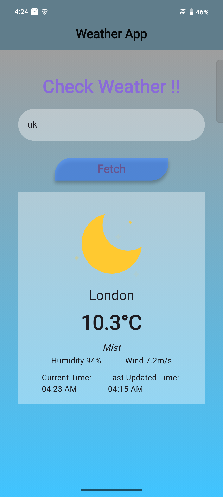
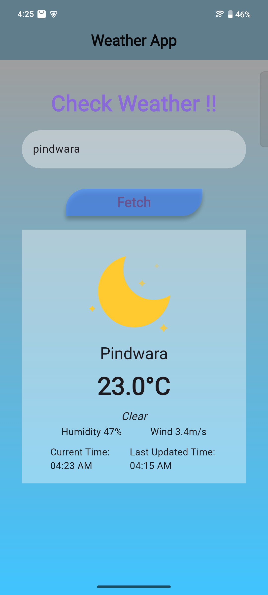
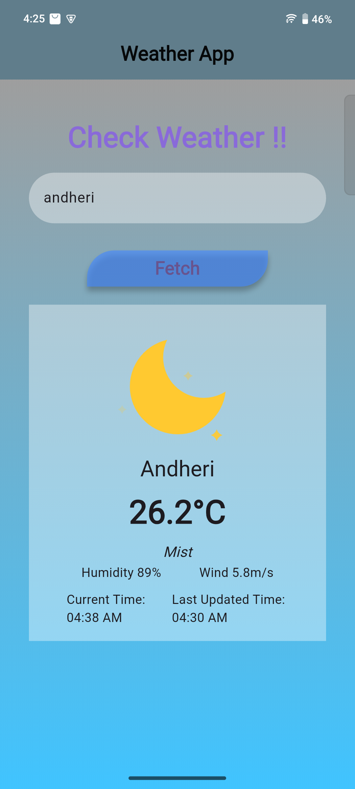

# Weather App

A new Flutter project.

## Getting Started

### I have made Weather App which can fetch data using API and give live status of whether according to city

### I have used this api

- https://www.weatherapi.com/api-explorer.aspx#current

### Some of screenshot :

   
   

